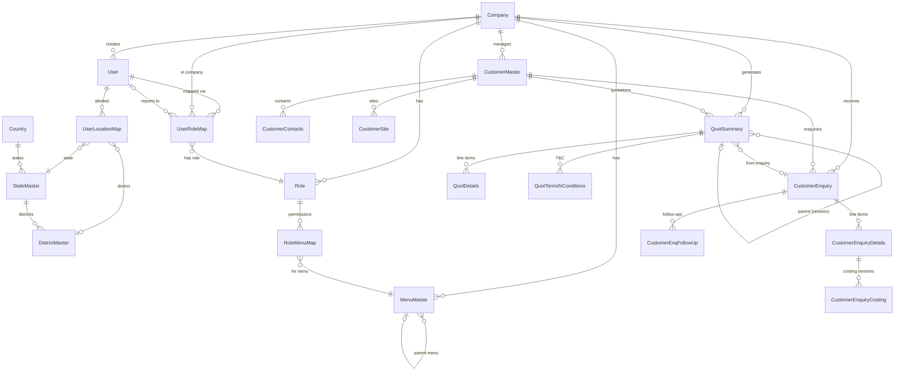

# SNM Portal — Codebase Documentation

> **Last updated:** 2026-04-18  
> **Application:** SNM (Sales & Network Management) Portal  
> **Type:** Multi-Tenant B2B SaaS Portal  
> **Domain:** Steel / Industrial Manufacturing — Enquiry → Quotation → Costing lifecycle

---

## Table of Contents

1. [Application Overview](#1-application-overview)
2. [Technology Stack](#2-technology-stack)
3. [High-Level Architecture](#3-high-level-architecture)
4. [Project Structure](#4-project-structure)
5. [Authentication Flow](#5-authentication-flow)
6. [Multi-Tenancy (Company-wise Isolation)](#6-multi-tenancy-company-wise-isolation)
7. [RBAC — Role-Based Access Control](#7-rbac--role-based-access-control)
8. [The 7-Filter Access Pipeline](#8-the-7-filter-access-pipeline)
9. [Organizational Hierarchy & Visibility](#9-organizational-hierarchy--visibility)
10. [Location-Based Access Control](#10-location-based-access-control)
11. [Menu & Permission System](#11-menu--permission-system)
12. [Business Module Flows](#12-business-module-flows)
13. [Database Schema Overview](#13-database-schema-overview)
14. [Frontend Architecture](#14-frontend-architecture)
15. [Deployment Architecture](#15-deployment-architecture)
16. [Background Services](#16-background-services)
17. [Appendix: Role Templates & Default Setup](#17-appendix-role-templates--default-setup)

---

## 1. Application Overview

**SNM Portal** is a multi-tenant B2B enterprise portal designed for companies in the **steel / industrial manufacturing** sector. It manages the full **lead-to-quote lifecycle**:

```
Customer Management → Enquiry → Costing → Quotation → Approval → Print/Email
```

### Key Capabilities

| Capability | Description |
|---|---|
| **Multi-Tenancy** | Multiple companies on one platform, each fully isolated |
| **Company-wise RBAC** | Users can belong to multiple companies with different roles per company |
| **Org-Tree Hierarchy** | Hierarchical reporting structure that drives data visibility |
| **Location Scoping** | Geographic (State/District) access control for field teams |
| **Ownership Tracking** | Every enquiry/quotation has an owner; transfers are audited |
| **Quotation Versioning** | Revision chain with version history, approval/rejection |
| **TP Cost Auto-Update** | Daily background job updates raw material costs into draft quotations |

---

## 2. Technology Stack

### Backend
| Component | Technology |
|---|---|
| Framework | **FastAPI 0.115.6** (Python) |
| ORM | **SQLAlchemy 2.0** |
| Database | **Microsoft SQL Server** (via `pyodbc`) |
| Migrations | **Alembic** |
| Authentication | **JWT** (HS256) via `python-jose` |
| Password Hashing | **bcrypt** via `passlib` |
| File Storage | **Azure Blob Storage** or local filesystem |
| Scheduling | **APScheduler** (background TP cost updates) |

### Frontend
| Component | Technology |
|---|---|
| Framework | **Angular 21** (Standalone Components, no NgModules) |
| UI Library | **Angular Material 21** |
| State Management | RxJS BehaviorSubject + Angular Signals |
| Styling | SCSS with CSS custom properties (`--snm-*` variables) |
| Theming | Dark/Light mode via CSS variables + `body.dark-theme` class |
| HTTP | Angular `HttpClient` with JWT interceptor |

### Deployment
| Component | Technology |
|---|---|
| Web Server | **IIS** with URL Rewrite module |
| Backend Proxy | IIS rewrites `/api/*` → `localhost:8000` |
| Frontend Serving | IIS serves Angular build as static files |

---

## 3. High-Level Architecture

```
┌─────────────────────────────────────────────────────────────────────┐
│                          Web Browser                                │
│  Angular 21 SPA (localhost:4200 / IIS production)                   │
│  ┌────────────┐ ┌──────────┐ ┌──────────┐ ┌──────────────────────┐  │
│  │ Login Page │ │ Sidebar  │ │ Feature  │ │  Company Switcher /  │  │
│  │ (Auth)     │ │ (Menu)   │ │ Pages    │ │  Theme Toggle        │  │
│  └────────────┘ └──────────┘ └──────────┘ └──────────────────────┘  │
└────────────────────────────┬────────────────────────────────────────┘
                             │ HTTP (JWT Bearer)
                             ▼
┌─────────────────────────────────────────────────────────────────────┐
│                      FastAPI Backend (port 8000)                    │
│  ┌──────────────────────────────────────────────────────────────┐   │
│  │                     /api/v1/ Router                          │   │
│  │  auth │ companies │ users │ roles │ menus │ masters          │   │
│  │  customers │ enquiries │ quotations │ assets │ transfers     │   │
│  │  org-tree │ communication-logs │ cost-templates │ email      │   │
│  └────────────────────────┬─────────────────────────────────────┘   │
│                           │                                         │
│  ┌────────────────────────▼─────────────────────────────────────┐   │
│  │              Access Control Pipeline (RBAC v2)               │   │
│  │  F1 Auth → F2 Company → F3 Menu → F4 Parent → F5 Hierarchy  │   │
│  │                                   → F6 Location → F7 Rules   │   │
│  └────────────────────────┬─────────────────────────────────────┘   │
│                           │                                         │
│  ┌────────────────────────▼─────────────────────────────────────┐   │
│  │                    Service Layer                              │   │
│  │  auth_service │ access_service │ visibility_service           │   │
│  │  kro_location_service │ owner_resolver │ quotation_service    │   │
│  │  company_setup_service │ tp_cost_scheduler │ email_service    │   │
│  └────────────────────────┬─────────────────────────────────────┘   │
│                           │                                         │
│  ┌────────────────────────▼─────────────────────────────────────┐   │
│  │              SQLAlchemy ORM (25+ models)                     │   │
│  └────────────────────────┬─────────────────────────────────────┘   │
└───────────────────────────┼─────────────────────────────────────────┘
                            │
                            ▼
                 ┌─────────────────────┐     ┌─────────────────────┐
                 │   SQL Server DB     │     │   Azure Blob Store  │
                 │   (SNMPortal)       │     │   (file uploads)    │
                 └─────────────────────┘     └─────────────────────┘
```

---

## 4. Project Structure

```
SNM-portal/
├── backend/
│   ├── app/
│   │   ├── main.py                       # FastAPI app factory
│   │   ├── core/
│   │   │   ├── config.py                 # Pydantic settings (.env)
│   │   │   ├── database.py               # SQLAlchemy engine + session
│   │   │   ├── security.py               # JWT encode/decode, bcrypt
│   │   │   ├── dependencies.py           # get_db, get_current_user, require_permission
│   │   │   ├── pagination.py             # Pagination utilities
│   │   │   ├── rate_limit.py             # Login rate limiter
│   │   │   └── timezone.py               # IST timezone helpers
│   │   ├── models/                       # SQLAlchemy ORM (25+ tables)
│   │   │   ├── base.py                   # AuditMixin (createdon, isActive, etc.)
│   │   │   ├── company.py                # Company (tenant)
│   │   │   ├── user.py                   # User + UserRoleMap
│   │   │   ├── role.py                   # RoleMaster (RBAC flags)
│   │   │   ├── menu.py                   # MenuMaster (self-referencing tree)
│   │   │   ├── role_menu_map.py          # RoleMenuMap (CRUD + extended perms)
│   │   │   ├── customer.py               # CustomerMaster, Contacts, Sites
│   │   │   ├── enquiry.py                # Enquiry, Details, Costing, FollowUp
│   │   │   ├── quotation.py              # QuotSummary, Details, T&C, FollowUp
│   │   │   ├── user_location_map.py      # User ↔ State/District mapping
│   │   │   ├── ownership_transfer.py     # Transfer audit trail
│   │   │   └── ...                       # 15+ more master/lookup models
│   │   ├── schemas/                      # Pydantic v2 request/response DTOs
│   │   ├── services/                     # Business logic (pure functions)
│   │   │   ├── access_service.py         # ★ Unified RBAC v2 pipeline
│   │   │   ├── auth_service.py           # Login, company selection, JWT
│   │   │   ├── visibility_service.py     # Org-tree BFS (who can see whom)
│   │   │   ├── kro_location_service.py   # KRO location subset enforcement
│   │   │   ├── location_access_service.py# Location filter SQL builder
│   │   │   ├── owner_resolver.py         # Enquiry/Quotation owner resolution
│   │   │   ├── company_setup_service.py  # Seed default menus/roles/perms
│   │   │   ├── quotation_service.py      # Quotation revision chain
│   │   │   ├── tp_cost_scheduler.py      # TP cost auto-update
│   │   │   └── ...
│   │   └── api/v1/                       # Route handlers (16 routers)
│   │       ├── router.py                 # Aggregates all routers → /api/v1
│   │       ├── auth.py                   # Login, select-company, refresh
│   │       ├── customers.py, enquiries.py, quotations.py, ...
│   │       └── transfers.py              # Ownership transfer workflow
│   ├── alembic/                          # DB migrations
│   └── requirements.txt
│
├── frontend/
│   └── src/app/
│       ├── core/
│       │   ├── auth/                     # auth.service, auth.guard, auth.interceptor, token.service
│       │   └── services/                 # api, menu, theme, notification, company-context
│       ├── shared/
│       │   ├── components/               # dynamic-menu, company-switcher, confirm-dialog, profile-menu
│       │   └── directives/               # has-permission.directive (*appHasPermission)
│       ├── layout/                       # main-layout (sidenav + toolbar + router-outlet)
│       ├── features/
│       │   ├── auth/login/               # Login page + company picker
│       │   ├── dashboard/                # Dashboard
│       │   ├── company/                  # Company CRUD (super admin)
│       │   ├── users/                    # User CRUD + role mapping + location mapping
│       │   ├── roles/                    # Role CRUD + role-menu-mapping tree
│       │   ├── org-tree/                 # Org hierarchy canvas (dagre layout)
│       │   ├── masters/                  # 19 master data modules
│       │   ├── customers/                # Customer list + form + contacts + sites
│       │   ├── enquiries/                # Enquiry list + form + details + costing
│       │   ├── quotations/               # Quotation list + form + details + T&C + print
│       │   └── communication-logs/       # Communication log management
│       ├── app.routes.ts                 # All routes (lazy loaded, authGuard)
│       └── app.config.ts                 # App bootstrap providers
│
├── web.config                            # IIS rewrite rules (production)
└── CODEBASE-DOCUMENTATION.md             # ← This file
```

---

## 5. Authentication Flow

The application uses a **two-step authentication** process because users may belong to multiple companies:

```
                                    ┌──────────────────┐
                                    │  LOGIN SCREEN    │
                                    │  username + pwd  │
                                    └────────┬─────────┘
                                             │
                              POST /api/v1/auth/login
                              (rate-limited by IP)
                                             │
                                             ▼
                                    ┌──────────────────┐
                                    │ Validate creds   │
                                    │ Return:          │
                                    │  • tempToken     │
                                    │  • company list  │
                                    └────────┬─────────┘
                                             │
                              ┌──────────────┴──────────────┐
                              │                             │
                     Single Company              Multiple Companies
                     (auto-select)               (show company picker)
                              │                             │
                              └──────────────┬──────────────┘
                                             │
                            POST /api/v1/auth/select-company
                            (tempToken + companyId)
                                             │
                                             ▼
                                    ┌──────────────────┐
                                    │ Validate access  │
                                    │ Issue JWT pair:  │
                                    │  • accessToken   │
                                    │    (30 min)      │
                                    │  • refreshToken  │
                                    │    (7 days)      │
                                    └────────┬─────────┘
                                             │
                                             ▼
                                    ┌──────────────────┐
                                    │ Angular stores   │
                                    │ in localStorage: │
                                    │ snm_access_token │
                                    │ snm_refresh_tokn │
                                    │ snm_user_data    │
                                    └────────┬─────────┘
                                             │
                                             ▼
                                    ┌──────────────────┐
                                    │ Redirect to      │
                                    │ /dashboard       │
                                    │ Load menu tree   │
                                    └──────────────────┘
```

### JWT Payload Structure
```json
{
  "user_id": 5,
  "company_id": 2,
  "role_id": 8,
  "is_super_admin": false,
  "type": "access",
  "exp": 1713400000
}
```

### Company Switching (at runtime)
When a user switches companies via the header dropdown:
1. `POST /api/v1/auth/switch-company` → new JWT with different `company_id` + `role_id`
2. Frontend reloads menu tree (different menus per company)
3. All feature components refresh their data via `companyChanged$` observable

---

## 6. Multi-Tenancy (Company-wise Isolation)

**Company** is the fundamental **tenant boundary**. Every business entity in the database carries a `companyId` foreign key.

### How It Works

```
┌────────────────────────────────────────────────────────────────┐
│                        COMPANY A                               │
│  ┌─────────┐  ┌─────────┐  ┌─────────┐  ┌─────────────────┐  │
│  │ Users   │  │ Roles   │  │ Menus   │  │ Customers       │  │
│  │ (A)     │  │ (A)     │  │ (A)     │  │ Enquiries       │  │
│  │         │  │         │  │         │  │ Quotations (A)  │  │
│  └─────────┘  └─────────┘  └─────────┘  └─────────────────┘  │
└────────────────────────────────────────────────────────────────┘

┌────────────────────────────────────────────────────────────────┐
│                        COMPANY B                               │
│  ┌─────────┐  ┌─────────┐  ┌─────────┐  ┌─────────────────┐  │
│  │ Users   │  │ Roles   │  │ Menus   │  │ Customers       │  │
│  │ (B)     │  │ (B)     │  │ (B)     │  │ Enquiries       │  │
│  │         │  │         │  │         │  │ Quotations (B)  │  │
│  └─────────┘  └─────────┘  └─────────┘  └─────────────────┘  │
└────────────────────────────────────────────────────────────────┘
```

### Key Rules
1. **Every SQL query** filters by `companyId` from the JWT (via `apply_company_filter()`)
2. Roles are **company-scoped** — `Role.companyId` ties each role to a specific company
3. Menus are **company-scoped** — each company gets its own menu tree (seeded on creation)
4. **Users can span companies** — a user may have `UserRoleMap` entries for multiple companies, each with a different role
5. **SuperAdmin** is the only role that can bypass company isolation (sees all companies)

### Company Creation Flow
When a new company is created:
1. `company_setup_service.seed_company_defaults()` is called
2. It seeds:
   - A **SuperAdmin** and **Admin** role for the company
   - **45 default menus** (full menu tree matching frontend routes)
   - Full CRUD **permissions** on all menus for both roles
   - Maps existing SuperAdmin users to the new company

---

## 7. RBAC — Role-Based Access Control

### The Role Model

The RBAC system is **fully dynamic** — no role names are hardcoded in code. All behavior is driven by **flags on the `RoleMaster` table**:

```
┌──────────────────────────────────────────────────────────────────┐
│                        RoleMaster                                │
├──────────────────────────────────────────────────────────────────┤
│ roleId            │ Primary key                                  │
│ companyId          │ Tenant FK                                    │
│ roleName           │ Display name (e.g., "HOD", "Director")      │
├──────────────── Admin Flags ────────────────────────────────────┤
│ IsSuperAdmin       │ Bypasses ALL filters except F1 & F7         │
│ IsCompanyAdmin     │ Bypasses F5 (hierarchy) & F6 (location)     │
├──────────────── Hierarchy Flags ────────────────────────────────┤
│ downwardLevels     │ How many levels of subordinates visible      │
│                    │ (-1 = unlimited, 0 = none)                  │
│ upwardLevels       │ How many levels of superiors visible         │
│                    │ (-1 = unlimited, 0 = none)                  │
│ includeSubtreeOnUp │ When walking up, include ancestor subtrees  │
│ peerAccess         │ Can see siblings (same reportTo)            │
│ peerSubtree        │ If peerAccess, also see peers' subtrees     │
├──────────────── Location Flags ─────────────────────────────────┤
│ locationScopeReqd  │ If False → bypass location filter (F6)      │
│ enforceChildLocSub │ KRO: user's locations ⊆ reportTo's locations│
├──────────────── Other ──────────────────────────────────────────┤
│ numGenMode         │ own_code | parent_code | select_code        │
│ roleLevel          │ Authority rank (higher = more authority)    │
│ canApproveTransfers│ Can approve ownership transfer requests     │
└──────────────────────────────────────────────────────────────────┘
```

### Bypass Matrix (What Each Role Type Skips)

| Role Type | F2 Company | F3 Menu | F4 Parent | F5 Hierarchy | F6 Location |
|:---|:---:|:---:|:---:|:---:|:---:|
| **SuperAdmin** | ~~bypass~~ | ~~bypass~~ | ~~bypass~~ | ~~bypass~~ | ~~bypass~~ |
| **CompanyAdmin** | ✅ enforced | ✅ enforced | ✅ enforced | ~~bypass~~ | ~~bypass~~ |
| **Regular User** | ✅ enforced | ✅ enforced | ✅ enforced | ✅ enforced | ✅ enforced |

### Default Role Templates (seeded per company)
| Role | IsSuperAdmin | IsCompanyAdmin | downwardLevels | peerAccess | locationScope |
|---|:---:|:---:|:---:|:---:|:---:|
| SuperAdmin | ✅ | — | -1 | ✅ | ❌ |
| CompanyAdmin | ❌ | ✅ | -1 | ✅ | ❌ |
| Director | ❌ | ❌ | -1 | ✅ | ❌ |
| HOD | ❌ | ❌ | -1 | ❌ | ✅ |
| KRO | ❌ | ❌ | 0 | ❌ | ✅ (+ subset enforced) |

---

## 8. The 7-Filter Access Pipeline

Every API request passes through a **fail-fast, short-circuit pipeline** of 7 filters. If any filter fails, the request is immediately rejected (403/401).

```
 Request → F1 → F2 → F3 → F4 → F5 → F6 → F7 → ✅ Data
           │    │    │    │    │    │    │
           ▼    ▼    ▼    ▼    ▼    ▼    ▼
          401  403  403  403  403  403  400/422
```

### Filter Details

| # | Filter | What It Does | Implementation |
|---|---|---|---|
| **F1** | **Auth** | Validates JWT token, extracts `CurrentUser` | `get_current_user()` dependency |
| **F2** | **Company** | Adds `WHERE companyId = ?` to every query | `apply_company_filter()` |
| **F3** | **Menu Permission** | Checks `RoleMenuMap` for required action | `require_permission(menu, action)` |
| **F4** | **Parent Visibility** | For sub-resources: parent must be visible | `require_parent_visible()` |
| **F5** | **Hierarchy** | Record's `ownerUserId` must be in `visible_user_ids` | `apply_hierarchy_filter()` |
| **F6** | **Location** | Record's state/district must match user's allotted locations | `apply_location_filter()` |
| **F7** | **Business Rule** | Entity-specific validations (FY, status transitions, uniqueness) | Inline in each route handler |

### Per-Module Filter Application

| Module | F2 Company | F3 Menu | F4 Parent | F5 Hierarchy | F6 Location |
|---|:---:|:---:|:---:|:---:|:---:|
| Customers (master) | ✅ | ✅ | — | — | — |
| Customer Contacts | ✅ | ✅ | — | — | ✅ |
| Customer Sites | ✅ | ✅ | — | — | ✅ |
| **Enquiries** | ✅ | ✅ | — | ✅ | ✅ |
| Enquiry sub-resources | ✅ | ✅ | inherit | inherit | inherit |
| **Quotations** | ✅ | ✅ | — | ✅ | ✅ |
| Quotation sub-resources | ✅ | ✅ | inherit | inherit | inherit |
| Communication Logs | ✅ | ✅ | — | ✅ | — |

### AccessContext (single truth per request)

The `AccessContext` dataclass is computed once per request and carries all access info:

```python
@dataclass
class AccessContext:
    user_id: int
    company_id: int
    role_id: int
    is_super_admin: bool
    is_company_admin: bool
    role: Optional[Role]
    visible_user_ids: Optional[Set[int]]   # None = see all
    location: LocationAccess               # .bypass = True → see all
    _perm_cache: dict                      # menuName → RoleMenuMap row
    _db: Optional[Session]
```

---

## 9. Organizational Hierarchy & Visibility

### The Reporting Tree

Users are organized into a **tree structure** via `UserRoleMap.reportTo`:

```
                    ┌──────────────┐
                    │   Director   │
                    │  (User #1)   │
                    └──────┬───────┘
                           │
              ┌────────────┼────────────┐
              ▼            ▼            ▼
        ┌──────────┐ ┌──────────┐ ┌──────────┐
        │  HOD #1  │ │  HOD #2  │ │  HOD #3  │
        │ (User #2)│ │ (User #3)│ │ (User #4)│
        └────┬─────┘ └──────────┘ └────┬─────┘
             │                         │
        ┌────┴─────┐             ┌─────┴────┐
        │  KRO #1  │             │  KRO #2  │
        │ (User #5)│             │ (User #6)│
        └──────────┘             └──────────┘
```

### Visibility Rules (BFS Algorithm)

The `_build_visible_user_ids()` function performs a BFS traversal to determine which users' records the current user can see:

| Flag | Effect |
|---|---|
| `downwardLevels = -1` | See ALL subordinates (unlimited depth) |
| `downwardLevels = 2` | See only 2 levels of subordinates |
| `downwardLevels = 0` | See only own records |
| `upwardLevels = 1` | See 1 level of ancestors' records |
| `upwardLevels = -1` | See all ancestors up to root |
| `includeSubtreeOnUpward = true` | When walking up, also see each ancestor's entire subtree |
| `peerAccess = true` | See siblings (users with the same `reportTo`) |
| `peerSubtree = true` | If peer access, also see peers' subtrees |

### Example: What HOD #1 (User #2) Sees

With `downwardLevels=-1, upwardLevels=0, peerAccess=false`:
- **Own records** (User #2) ✅
- **KRO #1** (User #5) — direct subordinate ✅
- **HOD #2** (User #3) — peer ❌ (peerAccess=false)
- **Director** (User #1) — parent ❌ (upwardLevels=0)

With `upwardLevels=1, includeSubtreeOnUpward=true`:
- All of above ✅ PLUS
- **Director** (User #1) ✅
- **HOD #2, #3** (Director's subtree) ✅
- **KRO #2** (User #6, via HOD #3's subtree) ✅

---

## 10. Location-Based Access Control

### How It Works

Users are mapped to geographic locations via `UserLocationMap`:

```
UserLocationMap
├── userId
├── companyId
├── countryId → Country
├── stateId   → StateMaster
└── districtId → DistrictMaster (nullable — NULL = full state access)
```

### Location Resolution

1. If `districtId IS NULL` → user has **full state access** (all districts)
2. If `districtId IS NOT NULL` → user has access to that **specific district only**
3. Records with **no location** (NULL state/district) → always pass the filter

### KRO Location Subset Enforcement

When a role has `enforceChildLocationSubset = true`:

```
Director (Maharashtra: all, Gujarat: all)
    │
    ├── HOD (Maharashtra: Mumbai, Pune)     ← subset of director ✅
    │       │
    │       └── KRO (Maharashtra: Mumbai)   ← subset of HOD ✅
    │
    └── HOD (Karnataka: Bangalore)          ← NOT subset ❌ (blocked!)
```

**Cascade rules:**
- **On role assignment**: Auto-inherit parent's full location set
- **On location assignment**: Validate new locations ⊆ parent's locations
- **On parent location reduction**: Cascade-narrow children's locations to intersection

---

## 11. Menu & Permission System

### Menu Tree Structure

Menus are a **self-referencing tree** (`MenuMaster.parentMenuId`):

```
Dashboard
Administration
├── Company Management
├── User Management
├── Role Management
├── User Location Mapping
└── Organization Tree
Masters
├── Item Grade
├── Item Name
├── Item Length / Size
├── Delivery Term / Mode
├── Contact Type
├── Customer Classification
├── Cost Point
├── Terms & Conditions
├── Raw Material Cost
├── Country / State / District
├── Dia Master
├── Enquiry Status / Quotation Status
├── Communication Mode
└── Financial Year
Customers
├── Customer List
Enquiries
├── Enquiry List
Quotations
├── Quotation List
Assets
├── Quotation Formats
Logs
├── Communication Logs
```

### Permission Flags (RoleMenuMap)

Each role has a `RoleMenuMap` row per menu with these flags:

| Flag | Purpose |
|---|---|
| `CanAdd` | Can create new records |
| `CanRead` | Can view/list records |
| `CanEdit` | Can modify existing records |
| `CanDelete` | Can soft-delete records |
| `CanEditNumber` | Can edit auto-generated numbers (enqNo, quotNo) |
| `CanApprove` | Can approve quotations |
| `CanRevise` | Can create quotation revisions |
| `CanTransferOwnership` | Can transfer enquiry/quotation ownership |
| `CanGenerateUnderOthers` | Can create records on behalf of other users |

### Frontend Permission Enforcement

```typescript
// Structural directive — shows/hides UI elements based on permissions
<button *appHasPermission="'Customers:canAdd'">Add Customer</button>

// MenuService provides the permission map:
// { menuName: { canAdd, canRead, canEdit, canDelete, ... } }
```

---

## 12. Business Module Flows

### 12.1 Customer Management

```
Customer List (filtered by company)
    │
    ├──[Add]──→ Customer Form
    │           ├── Basic Info (name, code, GSTN, PAN, classification)
    │           ├── Contacts tab (multiple contacts per customer)
    │           │   └── Each contact has: state, district → location-filtered
    │           └── Sites tab (multiple sites per customer)
    │               └── Each site has: state, district → location-filtered
    │
    └──[Edit/View]──→ Same form with pre-populated data
```

**RBAC:** Customer master is company-wide visible (no hierarchy filter). Individual contacts and sites are location-filtered.

### 12.2 Enquiry Flow

```
┌──────────────┐     ┌──────────────┐     ┌──────────────┐
│  Enquiry     │     │  Enquiry     │     │  Enquiry     │
│  List        │────→│  Form        │────→│  Details     │
│  (filtered)  │     │  (header)    │     │  (line items)│
└──────────────┘     └──────────────┘     └──────┬───────┘
                                                 │
                                          ┌──────┴───────┐
                                          │  Costing     │
                                          │  (per detail │
                                          │   per version)│
                                          └──────────────┘

Status Flow:  New → In Progress → Quoted → Closed
                                        → Lost
```

**Ownership:** When creating an enquiry, the `owner_resolver` determines the owner based on:
- `own_code` → creator is the owner
- `parent_code` → creator's reportTo is the owner
- `select_code` → explicitly selected user is the owner

**RBAC:** Enquiries are filtered by hierarchy (F5) + location (F6, via customer site).

### 12.3 Quotation Flow

```
                 ┌────────────────────┐
                 │  Quotation List    │
                 │  (company + role   │
                 │   filtered)        │
                 └────────┬───────────┘
                          │
      ┌───────────────────┼───────────────────┐
      ▼                   ▼                   ▼
┌──────────┐     ┌───────────────┐     ┌─────────────┐
│  New     │     │  From Enquiry │     │  Existing   │
│  (blank) │     │  (pre-fill)   │     │  (edit)     │
└────┬─────┘     └───────┬───────┘     └──────┬──────┘
     │                   │                    │
     └───────────────────┴────────────────────┘
                         │
                    ┌────┴────┐
                    │ Quotation│
                    │ Form     │
                    ├──────────┤
                    │ Header   │ customer, contact, site, delivery terms
                    │ Details  │ line items with cost heads (22 columns)
                    │ T&C      │ terms & conditions
                    └────┬─────┘
                         │
            ┌────────────┼────────────┐
            ▼            ▼            ▼
      ┌──────────┐ ┌──────────┐ ┌──────────┐
      │ Approve  │ │ Revise   │ │ Print    │
      │ (→Apprvd)│ │ (→new    │ │ (PDF     │
      │          │ │  version)│ │  preview)│
      └──────────┘ └──────────┘ └──────────┘

Status Flow:

  Draft ──→ Approved ──→ Matured
    │           │
    │           └──→ Revised (creates new version → Draft)
    │
    └──→ Cancelled
```

**Versioning:** Each revision creates a new `QuotSummary` row with:
- `versionNo` incremented
- `parentQuotId` pointing to the original
- `quotNo` appended with `-R1`, `-R2`, etc.
- Previous version's status set to `Revised` (read-only)

**Cost Heads (22 columns per line item):**

| Cost Head | Description |
|---|---|
| TPWGST | Transfer Price with GST |
| Marketing | Marketing cost |
| FreightTrailer / FreightTruck | Freight costs |
| Unloading | Unloading cost |
| OHD, IFC, WeighmentDiff | Overhead, IFC, weighment |
| CD, SWECharge, CRS | Cash discount, SWE, CRS |
| IncCharge, ShortLnthCharge | Incidental, short length charges |
| SpeciFicLnthCharge, ExtraCharge | Specific length, extra charges |
| Fluctuation, Commission, Misc | Market adjustments |
| Testing, MOUTOD, SplDisc, JC | Testing, MOU/TOD, special discount, JC |

**Calculated fields:** `totRate` (sum of cost heads) → `GST` (18%) → `totAmount` (total + GST)

### 12.4 Ownership Transfer Flow

```
User A (owner) ──→ Request Transfer ──→ Pending
                    (to User B)          │
                                         ▼
                                   Approver reviews
                                    (canApproveTransfers
                                     or SuperAdmin)
                                         │
                              ┌──────────┴──────────┐
                              ▼                     ▼
                         Approved               Rejected
                    (ownerUserId →              (no change)
                     User B)
```

- Target user must be in initiator's `visible_user_ids`
- Quotation transfer auto-reverts status: `Approved → Draft` (new owner must re-approve)
- Full audit trail in `OwnershipTransfer` table

### 12.5 Communication Logs

Track all customer communications:
- Mode (call, email, visit, etc.)
- Notes, follow-up date
- Linked to customer, enquiry, or quotation
- Filtered by hierarchy (F5)

---

## 13. Database Schema Overview

### Entity Relationship Diagram (Logical)



### All Tables (25+)

| Table | Purpose | Key FKs |
|---|---|---|
| `Company` | Tenant entity | — |
| `UserMaster` | User accounts | companyId |
| `UserRoleMap` | User ↔ Role ↔ Company mapping | userId, roleId, companyId, reportTo |
| `RoleMaster` | Roles with RBAC flags | companyId |
| `MenuMaster` | Menu tree | companyId, parentMenuId |
| `RoleMenuMap` | Role × Menu permissions | roleId, menuId |
| `UserLocationMap` | User geographic access | userId, companyId, stateId, districtId |
| `CustomerMaster` | Customer records | companyId |
| `CustomerContacts` | Customer contact persons | customerId, companyId |
| `CustomerSite` | Customer delivery sites | customerId, companyId |
| `CustomerEnquiry` | Enquiry header | companyId, customerId, ownerUserId |
| `CustomerEnquiryDetails` | Enquiry line items | enqId, companyId |
| `CustomerEnquiryCosting` | Costing per detail (versioned) | enqId, enqDtlId |
| `CustomerEnqFollowUp` | Enquiry follow-ups | enqId |
| `QuotSummary` | Quotation header | companyId, customerId, ownerUserId, parentQuotId |
| `QuotDetails` | Quotation line items (with 22 cost heads) | quotId, companyId |
| `QuotTermsNConditions` | Quotation T&C | quotId |
| `QuotFollowUp` | Quotation follow-ups | quotId |
| `OwnershipTransfer` | Transfer audit trail | entityType, entityId, fromUserId, toUserId |
| `CostTemplate` | Reusable cost head templates | companyId |
| `RawMaterialCost` | TP cost per dia (with effective date) | companyId |
| `FinancialYear` | Financial year definitions | companyId |
| `ItemGrade/Name/Length/Size` | Item master data | companyId |
| `DeliveryTerm/Mode` | Delivery master data | companyId |
| `DiaMaster` | Dia (diameter) master | companyId |
| `Country/StateMaster/DistrictMaster` | Geographic master | parent FKs |
| `Asset` | Uploaded files metadata | companyId |
| `CommunicationMode/Log` | Communication tracking | companyId |

### AuditMixin (applied to all tables)
Every table inherits:
```
createdon     DateTime   (default: now IST)
createdby     Integer    (user ID)
lastupdateon  DateTime   (auto-updated)
lastupdateby  Integer    (user ID)
isActive      Boolean    (default: True — soft delete flag)
```

---

## 14. Frontend Architecture

### Component Architecture

```
AppComponent (root)
└── MainLayoutComponent (authGuard protected)
    ├── mat-toolbar
    │   ├── Menu Toggle Button
    │   ├── Company Switcher (dropdown, visible if user has >1 company)
    │   ├── Theme Toggle (dark/light)
    │   └── Profile Menu (avatar + change password)
    │
    ├── mat-sidenav
    │   └── DynamicMenuComponent (recursive 3-level menu)
    │       ├── Level 1: Top categories (Dashboard, Administration, ...)
    │       ├── Level 2: Sub-menus (User Management, Role Management, ...)
    │       └── Level 3: Leaf items (if any)
    │
    └── mat-sidenav-content
        └── <router-outlet> → Feature Components
```

### Feature Component Pattern

All feature modules follow a consistent pattern:

```
List Component (MatTable + MatPaginator + MatSort)
├── Search/Filter bar
├── [Add] button (*appHasPermission="'Module:canAdd'")
├── Data table with actions per row
│   ├── [Edit] (*appHasPermission="'Module:canEdit'")
│   └── [Delete] (*appHasPermission="'Module:canDelete'")
└── Dialog or Form page for create/edit
```

### Key Services

| Service | Responsibility |
|---|---|
| `AuthService` | Login/logout, company selection, token management |
| `TokenService` | localStorage read/write for tokens |
| `ApiService` | Generic HTTP wrapper (typed get/post/put/delete) |
| `MenuService` | Loads role-based menu tree, builds permission map |
| `CompanyContextService` | Company switching orchestration, emits `companyChanged$` |
| `ThemeService` | Dark/light mode toggle (Angular signals + localStorage) |
| `NotificationService` | MatSnackBar wrapper (success/error/info) |

### Routing Structure

```typescript
Routes:
/login                              → LoginComponent
/ (authGuard)                       → MainLayoutComponent
├── /dashboard                      → DashboardComponent
├── /companies                      → CompanyListComponent (super admin)
├── /users                          → UserListComponent
├── /roles                          → RoleListComponent
├── /roles/:roleId/menu-mapping     → RoleMenuMappingComponent
├── /masters/item-grades            → ItemGradeListComponent
├── /masters/...                    → (19 master modules)
├── /customers                      → CustomerListComponent
├── /customers/new                  → CustomerFormComponent
├── /customers/:id/edit             → CustomerFormComponent
├── /enquiries                      → EnquiryListComponent
├── /enquiries/new | :id/edit       → EnquiryFormComponent
├── /quotations                     → QuotationListComponent
├── /quotations/new | :id/edit      → QuotationFormComponent
├── /quotations/:id/print           → QuotationPrintComponent
├── /org-tree                       → OrgTreeComponent
├── /communication-logs             → CommunicationLogListComponent
├── /user-location-mapping          → UserLocationListComponent
└── /assets/quotation-formats       → QuotationFormatListComponent
```

### Theming System

40+ CSS custom properties defined on `:root` (light) and `body.dark-theme` (dark):

```
--snm-text-primary          Text colors
--snm-accent                Brand accent color
--snm-glass-bg              Glassmorphism backgrounds
--snm-bg-card               Card backgrounds
--snm-border-field          Input borders
--snm-error                 Error state
--snm-super-admin           Super admin UI accent
```

---

## 15. Deployment Architecture

### IIS Production Setup

```
IIS (port 80/443)
├── Static Files (Angular dist/)
│   └── index.html, *.js, *.css, assets/
│
├── URL Rewrite Rules (web.config)
│   ├── /api/* → Proxy to http://localhost:8000/api/*
│   └── Everything else → Rewrite to index.html (Angular SPA routing)
│
└── Cache Rules
    ├── index.html → no-cache (always fresh)
    └── Static assets → 365 day max-age (hash-based names)
```

### Backend Process
```
uvicorn app.main:app --port 8000
├── FastAPI application
├── APScheduler (TP cost daily job at midnight IST)
└── CORS: allows all origins (*)
```

---

## 16. Background Services

### TP Cost Auto-Update (daily at midnight IST)

```
                  ┌─────────────────────┐
                  │ APScheduler trigger  │
                  │ 00:00 IST daily      │
                  └────────┬────────────┘
                           │
                           ▼
                  ┌─────────────────────┐
                  │ For each company:   │
                  │ 1. Get latest TP    │
                  │    costs per dia    │
                  │    (effectedFrom    │
                  │     <= today)       │
                  └────────┬────────────┘
                           │
                           ▼
               ┌───────────────────────────┐
               │ Update Draft Quotations   │
               │ • Find all Draft quots    │
               │ • For each line item:     │
               │   if dia matches →        │
               │   update TPWGST,          │
               │   recalc totRate,         │
               │   GST, totAmount          │
               └───────────────────────────┘
```

**Safety:**
- Only updates `Draft` quotations (never `Approved` / `Matured` / `Revised`)
- Only updates if the new TP cost is different from the current value
- Logs the number of rows updated per company

---

## 17. Appendix: Role Templates & Default Setup

### Company Onboarding Sequence

```
1. SuperAdmin creates new Company
        │
        ▼
2. seed_company_defaults() runs:
   ├── Create "Super Admin" role (IsSuperAdmin=True)
   ├── Create "Admin" role (standard admin)
   ├── Insert 45 default menus (matching frontend routes)
   ├── Grant full CRUD on all menus to both roles
   └── Map existing SuperAdmin users to this company
        │
        ▼
3. Admin logs in, customizes:
   ├── Creates additional roles (HOD, Director, KRO, etc.)
   ├── Configures hierarchy flags per role
   ├── Sets up menu permissions per role
   ├── Creates users
   └── Sets up org-tree (reportTo relationships)
        │
        ▼
4. Users can now:
   ├── Login → Select Company → See role-appropriate menus
   ├── Create/manage customers, enquiries, quotations
   └── Data visibility governed by hierarchy + location filters
```

### Number Generation Modes

| Mode | How Owner Is Determined | Use Case |
|---|---|---|
| `own_code` | Creator = owner | Default for most roles |
| `parent_code` | Creator's reportTo = owner | KRO creates under their HOD's code |
| `select_code` | Explicitly selected user = owner | Admin creating on behalf of others |

---

> **End of Documentation**
